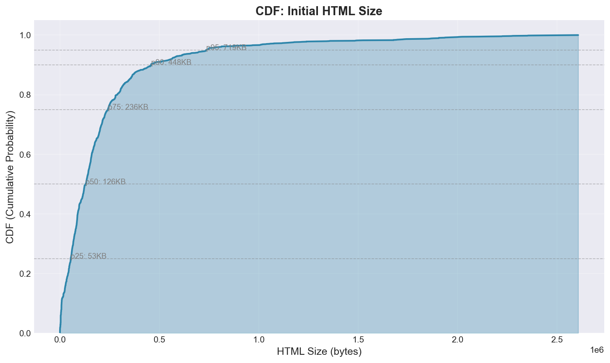
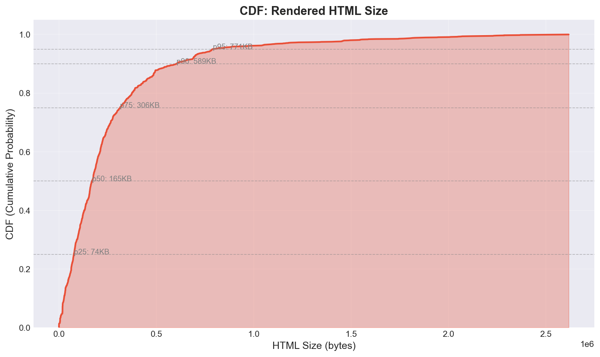
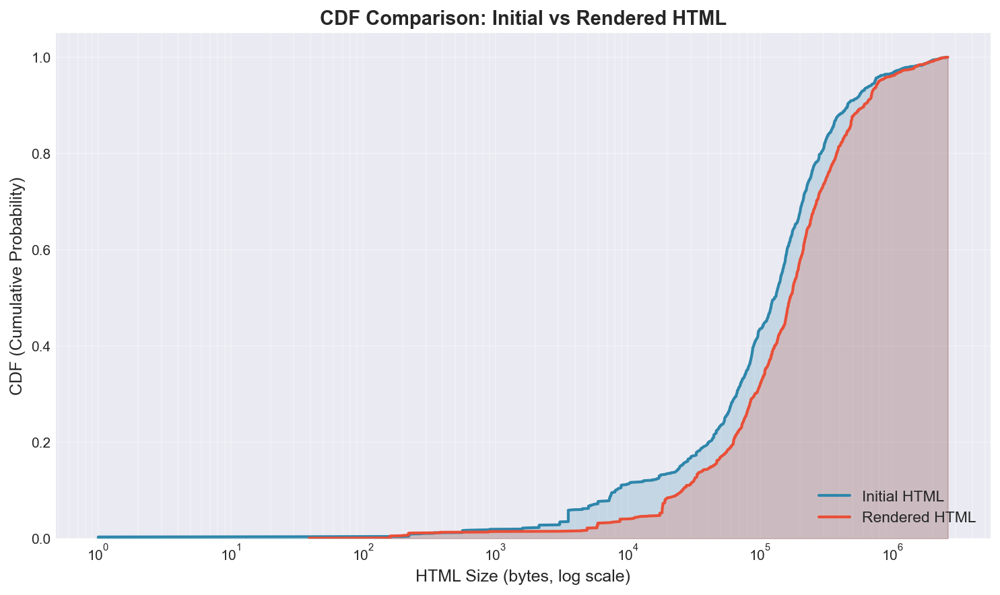

# Crawl Statistics Report

## Summary
- **Total URLs crawled**: 2,000
- **Success rate**: 85.4%
- **Failed/Timeout**: 293 (14.6%)

## HTML Size Statistics

### Initial HTML (before rendering)
| Metric | Value |
|--------|-------|
| Min | 1 bytes (0.0 KB) |
| Max | 2,606,434 bytes (2.49 MB) |
| Median | 128,561 bytes (125.5 KB) |
| Mean | 216,150 bytes (211.1 KB) |
| p90 | 458,482 bytes |
| p95 | 735,949 bytes |
| p99 | 1,905,696 bytes |

### Rendered HTML (after JS execution)
| Metric | Value |
|--------|-------|
| Min | 39 bytes (0.0 KB) |
| Max | 2,617,486 bytes (2.50 MB) |
| Median | 168,089 bytes (164.1 KB) |
| Mean | 267,812 bytes (261.5 KB) |
| p90 | 609,323 bytes |
| p95 | 790,118 bytes |
| p99 | 1,914,892 bytes |

### Size Ratio (Rendered / Initial)
| Metric | Value |
|--------|-------|
| Median ratio | 1.13x |
| Mean ratio | 73.26x |
| Max expansion | 19754.00x |
| Max shrinkage | 0.08x |

## Timing Statistics
| Metric | Value |
|--------|-------|
| Total elapsed | 176800.4s (49.11 hours) |
| Avg per URL | 88.4s |
| Median | 80.0s |
| Min | 4.3s |
| Max | 260.3s |

## CDF Plots

### Initial HTML Bytes CDF

### Rendered HTML Bytes CDF

### Comparison CDF (Initial vs Rendered)

